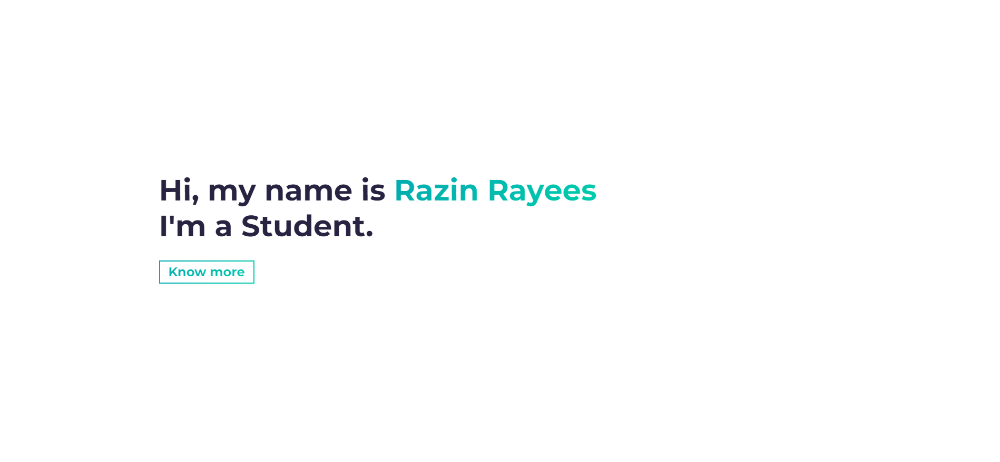

<h2 align="center">
  Portfolio Website 
  <a href="razin.in" target="_blank">razin.in</a>
</h2>

  

 

<h3 align="center">
    🔹
    <a href="https://github.com/razinrayees/Portfolio/issues">Report Bug</a> &nbsp; &nbsp;
    🔹
    <a href="https://github.com/razinrayees/Portfolio/issues">Request Feature</a>
</h3>
